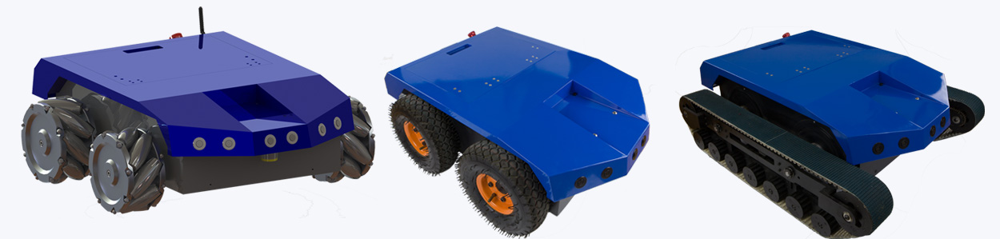
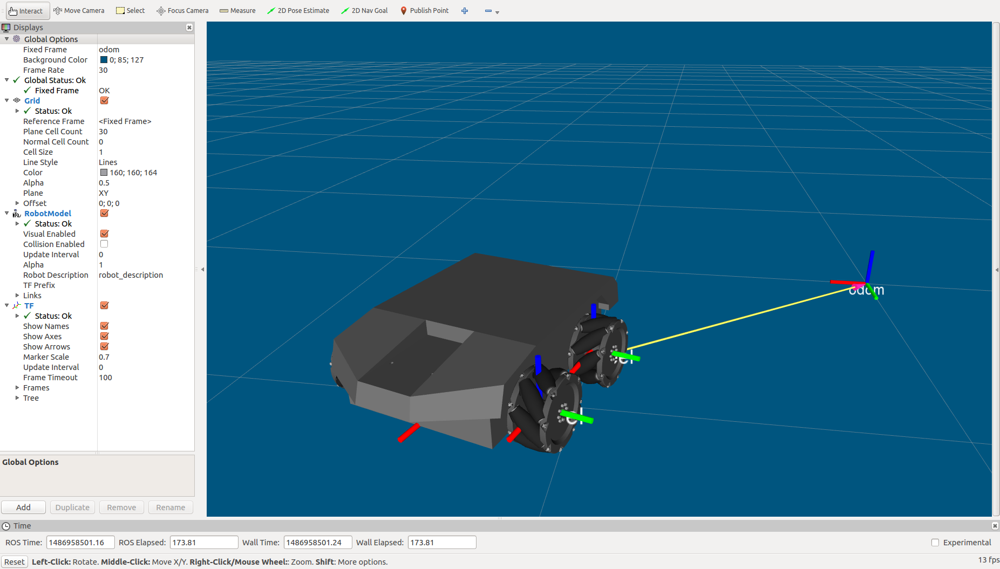
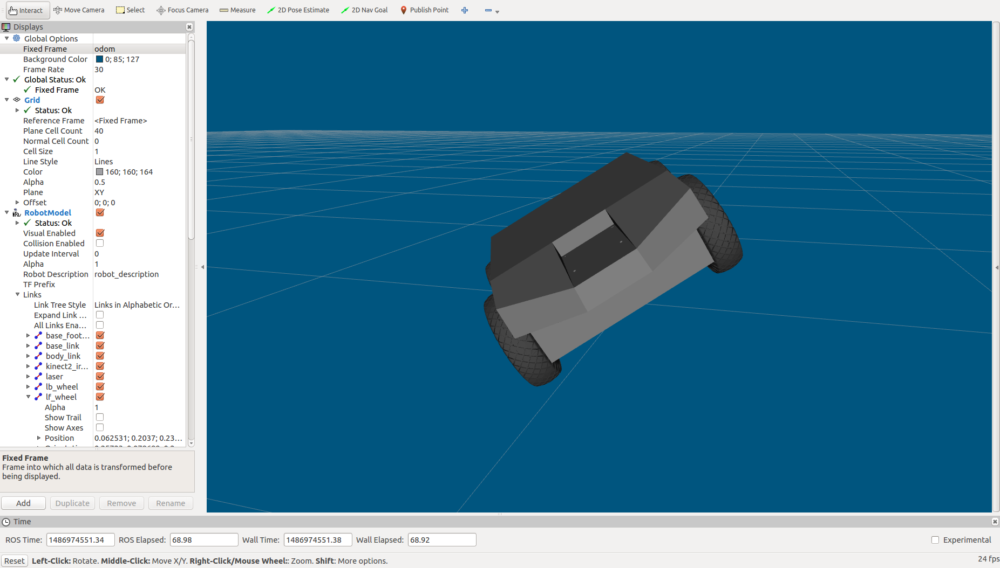
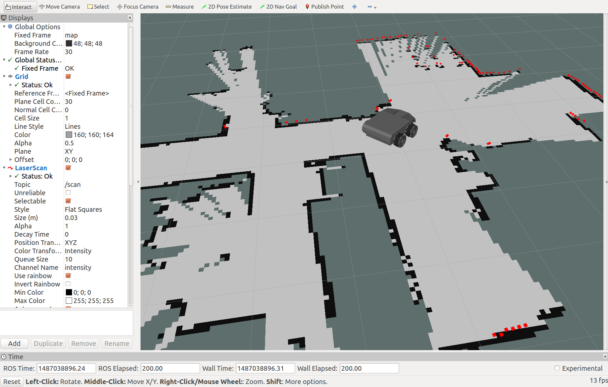
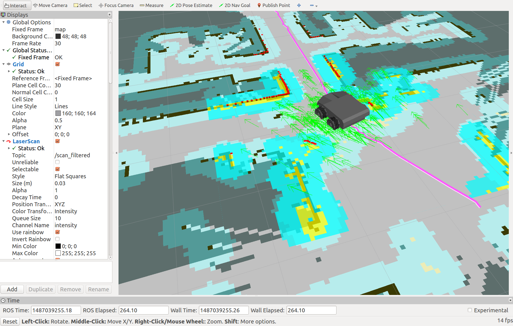
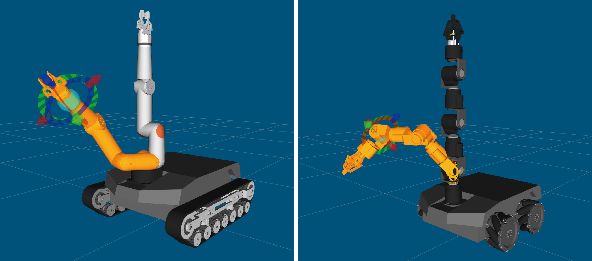
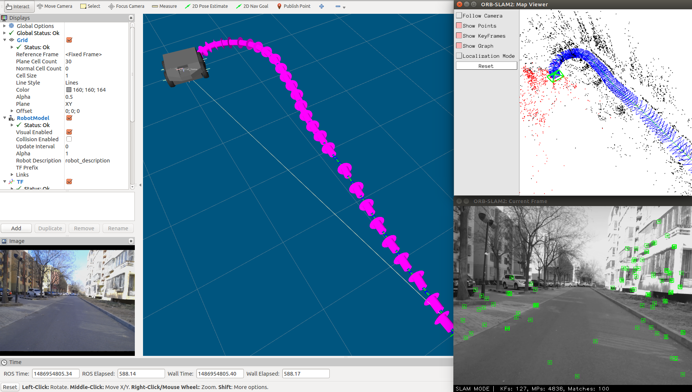
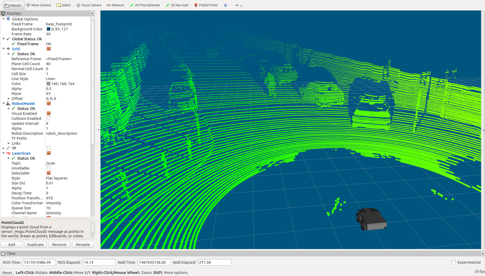

# 启程4机器人开放源码

## 使用步骤

1. 安装ROS(indigo/Ubuntu 14.04). [安装步骤](http://wiki.ros.org/indigo/Installation/Ubuntu)
2. 配置好开发环境. [配置方法](http://wiki.ros.org/ROS/Tutorials/InstallingandConfiguringROSEnvironment)
3. 安装依赖项:
```
sudo apt-get install ros-indigo-joy
sudo apt-get install ros-indigo-hector-mapping
sudo apt-get install ros-indigo-gmapping 
sudo apt-get install ros-indigo-map-server
sudo apt-get install ros-indigo-navigation
sudo apt-get install ros-indigo-move-base
sudo apt-get install ros-indigo-amcl
sudo apt-get install gstreamer0.10-pocketsphinx
sudo apt-get install gstreamer0.10-gconf
sudo apt-get install ros-indigo-audio-common
sudo apt-get install libasound2
sudo apt-get install ros-indigo-sound-play
```
4. 获取源码:
```
cd ~/catkin_ws/src/
git clone https://github.com/6-robot/wpv4.git
```
5. 设置设备权限
```
roscd wpv4_bringup
cd scripts
chmod +x create_udev_rules.sh
./create_udev_rules.sh 
```
6. 编译
```
cd ~/catkin_ws
catkin_make
```
7. 欢迎享用 :)

## 平台介绍
启程4是[北京六部工坊科技有限公司](http://www.6-robot.com)推出的一款功能强大、开放、灵活、具有出众越野能力和全天候工作能力的全地形移动机器人研究平台。该平台具备四轮驱动能力，每个轮轴皆配备独立的伺服驱动单元，具备精确的速度控制和电流过压保护功能。同时，每个轮轴还使用双电机防灾备份技术，具有超高的运行可靠性。轮轴输出可以根据应用类型外接真空轮胎、麦克纳姆全向轮或高强度履带，适应各种不同工作地形。


## 功能特性

### 1. URDF模型描述
启程4运行ROS操作系统，三种底盘型号都具备完整的URDF模型描述，可以在ROS系统里直接加载和扩展。


### 2. 电机码盘里程计
启程4装备了带编码器的直流伺服电机，可以在ROS里接收电机码盘计数，从而推算出机器人的移动里程信息。


### 3. IMU姿态传感
启程4内置了一枚六轴的IMU单元，可以实时获取机器人的滚转、倾斜和朝向信息，为机器人的上层控制算法提供数值依据。


### 4. SLAM环境建图
启程4可以根据应用类型的差异（室内或者室外），选配相应型号的激光雷达，借助HectorSLAM和GMapping算法，创建环境地图。


### 5. 自主定位导航
启程4将激光雷达扫描的距离信息与电机里程计数据进行融合，使用AMCL方法进行地图定位，结合ROS里的move_base进行自主导航。


### 6. 机械臂扩展
启程4硬件结构预留了机械臂安装位，软件上得益于ROS的灵活架构，可以快速进行机械臂功能的扩展集成。


### 7. 视觉SLAM
启程4的底盘类型的多样性保证了其在室外能够适用于多种不同地形，负重能力可搭载单目、双目视觉相机及复杂的高性能计算系统，是绝佳的室外视觉SLAM研究平台。


### 8. 自动驾驶
启程4拥有极强的机动性能，配合搭载Velodyne系列三维激光雷达，可以进行自动驾驶技术的相关研究。


